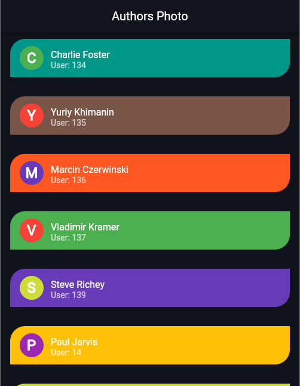
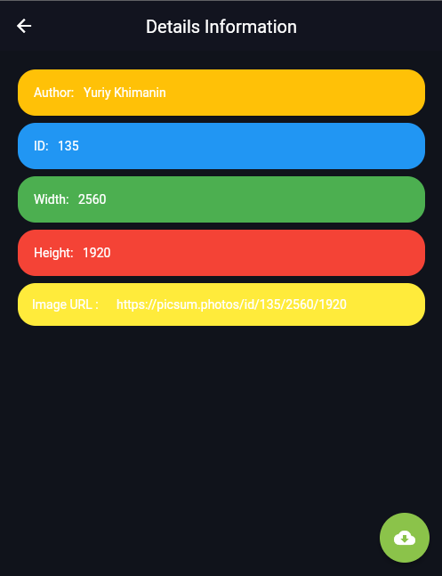

# Infinity ListView with API and Provider

Simple Flutter app that displays a list of items. Users can tap the item to see a detailed view of it. Uses https://picsum.photos/v2/list?page=pageNumber&limit=20 to get a list of items with infinite scrolling. 

Each hit will contain 20 items. The list item will contain only the id and author. Full information can be found on the detail page. You don’t have to show the images; just show the image URLs as clickable links.


## API Reference

#### Get all items

```http
  GET https://picsum.photos/v2/list?page=
```

| Parameter | Type     | Description                |
| :-------- | :------- | :------------------------- |
| `page` | `Integer` | **Required :** 1 |

#### Limit item

```http
 &limit=
```

| Parameter | Type     | Description                       |
| :-------- | :------- | :-------------------------------- |
| `limit`      | `Integer` | **As Required :** 20 |


## Screen 1




## Screen 2




## 🔗 Links
[](https://katherinempeterson.com/)
[](https://www.linkedin.com/)
[](https://twitter.com/)

